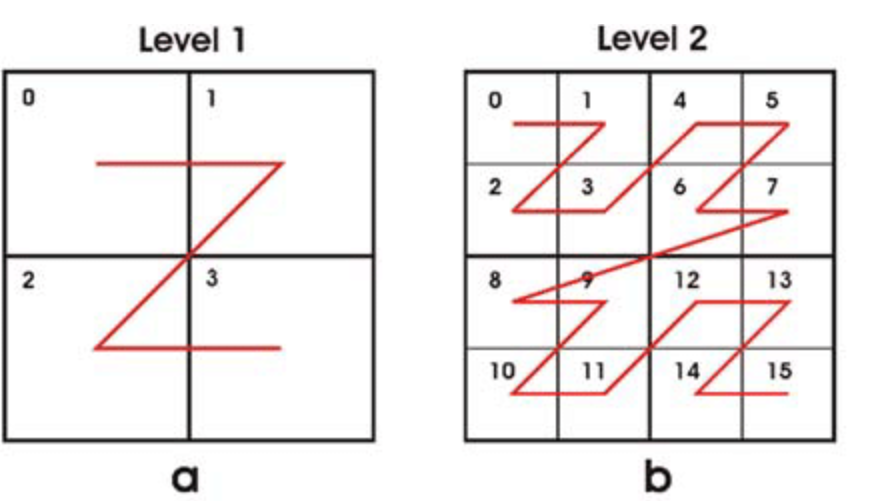

# Exercise 10: Space-Filling Curve Mapping (2D → 1D)

## Mathematical Foundation

### Space-Filling Curves
A **space-filling curve** is a curve whose range contains the entire 2-dimensional unit square. More precisely, it's a continuous surjective function from the unit interval [0,1] to the unit square [0,1]×[0,1].

**Key Properties:**
- **Surjective**: Every point in 2D space is mapped to some point in 1D
- **Continuous**: Small changes in 1D correspond to small changes in 2D
- **Space-filling**: The curve "fills" the entire 2D space

### Z-Order Curve (Morton Curve)
The Z-order curve is a specific type of space-filling curve that maps multidimensional data to one dimension while preserving locality reasonably well.



**Named for its pattern**: When you connect consecutive points in order, it traces a Z-like pattern.

## Algorithm: Bit Interleaving

### Core Concept
The Z-order curve uses **bit interleaving** (also called bit shuffling) to combine two coordinates into a single value.

For coordinates (x, y) with binary representations:
```
x = x₁₅x₁₄x₁₃...x₁x₀
y = y₁₅y₁₄y₁₃...y₁y₀
```

The Z-order value interleaves these bits:
```
z = y₁₅x₁₅y₁₄x₁₄y₁₃x₁₃...y₁x₁y₀x₀
```

### Implementation Steps

1. **Iterate through bit positions**: For each bit position i from 0 to 15
2. **Extract bits**: Get bit i from both x and y coordinates
3. **Interleave**: Place x bit at position 2i, y bit at position 2i+1
4. **Combine**: OR all the positioned bits together
5. **Normalize**: Convert to [0, 1] by dividing by 2³²-1

### Example Walkthrough

For (x=3, y=2):
```
x = 3 = 011₂ → x₂=0, x₁=1, x₀=1
y = 2 = 010₂ → y₂=0, y₁=1, y₀=0

Interleaving:
Position: ...y₂x₂y₁x₁y₀x₀
Bits:     ...001101
Result:   13₁₀ = 001101₂
```

**Step-by-step bit placement:**
```
i=0: bit_x=1, bit_y=0 → positions (0,1) → ...01
i=1: bit_x=1, bit_y=1 → positions (2,3) → ...1101  
i=2: bit_x=0, bit_y=0 → positions (4,5) → ...001101
Final: 001101₂ = 13₁₀
```

## Code Analysis

### Function Signature
```cpp
double map(uint16_t x, uint16_t y)
```

### Key Operations

1. **Bit extraction**: `(x >> i) & 1` gets bit i from x
2. **Bit positioning**: `bit_x << (2 * i)` places x bit at even position
3. **Bit combining**: `combined |= ...` accumulates all positioned bits
4. **Normalization**: Division by `0xFFFFFFFFUL` (2³²-1)

### Range Properties
- **Input**: x, y ∈ [0, 65535] (16-bit unsigned integers)
- **Output**: result ∈ [0, 1] (double precision)
- **Precision**: 32 bits of combined coordinate information

## Space-Filling Properties

### Locality Preservation
The Z-order curve has **good locality preservation**:
- Points close in 2D space tend to be close in 1D space
- Not perfect (some distant 2D points may be close in 1D)
- Better than naive concatenation approaches

### Quadrant Recursion
The Z-order curve exhibits recursive structure:
- Divides space into quadrants
- Each quadrant follows the same Z pattern
- Self-similar at all scales

### Fractal Characteristics
- **Hausdorff dimension**: 2 (fills the plane)
- **Recursive construction**: Each level refines the previous
- **Scale invariance**: Pattern repeats at all zoom levels

## Applications

### Database Indexing
Z-order curves enable efficient **multi-dimensional indexing**:
- Convert 2D queries to 1D range queries
- Better than separate indices on x and y
- Used in spatial databases and GIS systems

### Computer Graphics
- **Texture mapping**: Efficient memory access patterns
- **Image processing**: Cache-friendly pixel ordering
- **Mesh generation**: Good vertex ordering for rendering

### Parallel Computing
- **Load balancing**: Distribute 2D computational domains
- **Communication patterns**: Minimize data transfer
- **Cache optimization**: Improve memory locality

## Complexity Analysis

### Time Complexity
- **Per mapping**: O(log n) where n is coordinate precision
- **In practice**: O(1) for fixed 16-bit coordinates
- **Bit operations**: Constant time on modern processors

### Space Complexity
- **Memory usage**: O(1) constant space
- **No additional storage**: Direct computation
- **Cache friendly**: Sequential bit operations

## Comparison with Alternatives

### Hilbert Curve
- **Better locality**: Superior locality preservation
- **More complex**: Harder to implement
- **Still recursive**: Similar fractal properties

### Row-Major Ordering
- **Simple**: Concatenate y and x coordinates
- **Poor locality**: Horizontal neighbors far apart in 1D
- **No space-filling**: Doesn't preserve proximity well

### Peano Curve
- **Historical**: First space-filling curve discovered
- **Base 3**: Uses ternary instead of binary
- **More complex**: Harder to implement efficiently

## Mathematical Properties

### Bijectivity
For discrete coordinates, the mapping is **bijective**:
- Each (x, y) pair maps to unique value in [0, 1]
- Every possible bit pattern corresponds to valid coordinates
- Perfect one-to-one correspondence

### Continuity
In the limit of infinite precision:
- The mapping becomes continuous
- Small changes in input produce small changes in output
- Satisfies mathematical definition of space-filling curve

### Measure Preservation
The Z-order mapping preserves certain measures:
- Equal areas in 2D map to equal intervals in 1D
- Uniform distribution in 2D becomes uniform in 1D
- Measure-theoretic properties are maintained

## Implementation Optimizations

### SIMD Instructions
Modern processors offer **bit manipulation instructions**:
- BMI2 instruction set: PDEP/PEXT for bit scatter/gather
- Parallel bit interleaving in single instruction
- Significant speedup for bulk operations

### Lookup Tables
For smaller coordinate ranges:
- Pre-compute interleaving patterns
- Trade memory for computation time
- Useful for real-time applications

### Morton Codes
Industry standard term for Z-order values:
- Used in geographic information systems
- Standard algorithms in computational geometry
- Well-researched optimization techniques

## Testing Verification

### Property Verification
1. **Range checking**: All outputs in [0, 1]
2. **Bijectivity**: No two inputs produce same output
3. **Boundary behavior**: Corners map to expected values
4. **Bit patterns**: Verify interleaving logic

### Performance Testing
- **Throughput**: Mappings per second
- **Precision**: Floating-point accuracy
- **Memory usage**: Constant space verification

## Connection to Boolean Algebra

The bit interleaving operation connects to Boolean algebra:
- **Bit operations**: AND, OR, shift operations
- **Binary representation**: Natural fit for Boolean logic
- **Truth tables**: Each bit position follows Boolean rules

This exercise demonstrates how **combinatorial structures** (coordinates) can be mapped to **continuous domains** (real numbers) while preserving essential properties.

## Next Steps

This mapping function enables:
- **Exercise 11**: Implementing the inverse mapping
- **Spatial algorithms**: Multi-dimensional data structures
- **Graphics applications**: Efficient 2D to 1D conversions
- **Database systems**: Spatial indexing schemes
