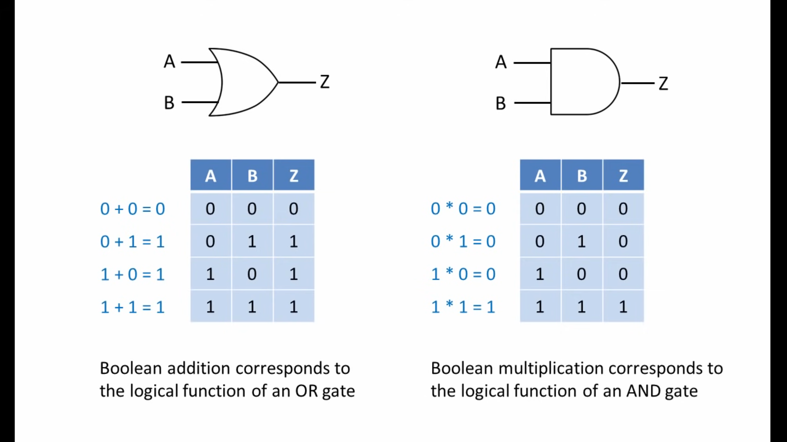
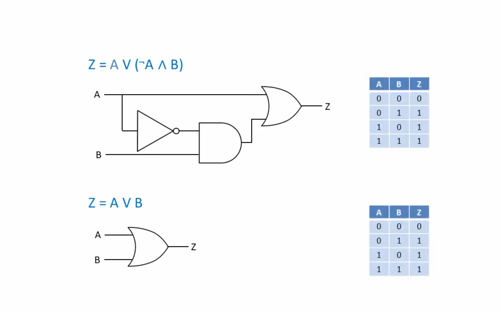

## **GENERAL IDEA**
- Boolean Algebra can be used to **simplify logic expressions**. It is a way to extract the simplest version possible of a given logic system to reduce it's complexity, components, energy requirements... while maintaining the same output.

## **Boolean Operator Symbol Reference**

| **Operation** | **Mathematical Symbol** | **Programming Symbol** | **Logic Gate** | **Description** |
|---------------|------------------------|----------------------|----------------|-----------------|
| **AND** | `∧` | `&` | AND Gate | Both inputs must be true |
| **OR** | `∨` | `\|` | OR Gate | At least one input must be true |
| **NOT** | `¬` | `!` | NOT Gate | Inverts the input |
| **XOR** | `⊕` | `^` | XOR Gate | Exactly one input must be true |
| **IMPLIES** | `⇒` | `>` | - | "If A then B" |
| **EQUIVALENT** | `⇔` | `=` | - | "A if and only if B" |
| **TRUE** | `⊤` | `1` | - | Always true |
| **FALSE** | `⊥` | `0` | - | Always false |

## **Boolean Basic OPERATIONS**

## **Boolean Operators as "Rock Paper Scissors"**

### **The "Dominance" Pattern**
Your intuition is **spot-on**! Boolean operators do have a "dominance" hierarchy:

**OR (`|`) - "1 beats 0"**:
```
1 | anything = 1    (1 always wins)
0 | anything = anything    (0 is neutral)
```

**AND (`&`) - "0 beats 1"**:
```
0 & anything = 0    (0 always wins)
1 & anything = anything    (1 is neutral)
```

### **The Underlying Logic**

**OR = "At least one"**: If ANY input is true, result is true
- `1` (true) is **dominant** - it "infects" the result
- `0` (false) is **recessive** - it gets overridden

**AND = "All must be"**: ALL inputs must be true for result to be true
- `0` (false) is **dominant** - one false ruins everything
- `1` (true) is **recessive** - needs cooperation

### **Real-World Analogies**

**OR = "Emergency Exit"**
- ANY door being open = building is open
- ONE broken security sensor = alarm triggered
- `1` dominates because "something happened"

**AND = "Security Check"**
- ALL conditions must pass = access granted
- ONE failure = denied access
- `0` dominates because "something failed"

### **Annulment vs Identity Laws**

**Annulment = "Absolute Dominance"**:
```
A | 1 = 1    // 1 always wins in OR
A & 0 = 0    // 0 always wins in AND
```

**Identity = "Neutral Elements"**:
```
A | 0 = A    // 0 doesn't change OR result
A & 1 = A    // 1 doesn't change AND result
```

### **Mental way to think about this:**
- **Annulment**: "Nuclear option" - one value destroys the other -> [**OR = <ins>OPTIMISTIC**</ins>] -> "if ANYTHING good happens, we're good
- **Identity**: "Neutral zone" - one value lets the other decide -> [**AND = <ins>PESIMISTIC**</ins>] -> "if ANYTHING bad happens, we're doomed

## **Boolean Operator Symbol Reference** 

| **Operation** | **Mathematical Symbol** | **Programming Symbol** | **Logic Gate** | **Description** |
|---------------|------------------------|----------------------|----------------|-----------------|
| **AND** | `∧` | `&` | AND Gate | Both inputs must be true |
| **OR** | `∨` | `|` | OR Gate | At least one input must be true |
| **NOT** | `¬` | `!` | NOT Gate | Inverts the input |
| **XOR** | `⊕` | `^` | XOR Gate | Exactly one input must be true |
| **IMPLIES** | `⇒` | `>` | - | "If A then B" |
| **EQUIVALENT** | `⇔` | `=` | - | "A if and only if B" |
| **TRUE** | `⊤` | `1` | - | Always true |
| **FALSE** | `⊥` | `0` | - | Always false |

## **Boolean Basic OPERATIONS** 
- Boolean <ins>**ADDITION**</ins> corresponds to the logical function of an <ins>**OR**</ins> gate.
- Boolean <ins>**MULTIPLICATION**</ins> corresponds to the logical function of an <ins>**AND**</ins> gate.
- *There is no such thing as Boolean SUBSTRACTION, as it implies the existence of negative numbers, but there's only 0 and 1. In the same sense, there is no DIVISION, as it can be defined as multiple substraction*




## **Boolean Fundamental Laws** 

### **1. Associative Laws** 
*"Grouping doesn't matter - you can rearrange parentheses"*

**OR Associative**: `(A ∨ B) ∨ C = A ∨ (B ∨ C)`
**AND Associative**: `(A ∧ B) ∧ C = A ∧ (B ∧ C)`

**Real-world analogy**: Like addition in math - `(2+3)+4 = 2+(3+4) = 9`

### **2. Commutative Laws** 
*"Order doesn't matter - you can swap operands"*

**OR Commutative**: `A ∨ B = B ∨ A`
**AND Commutative**: `A ∧ B = B ∧ A`

**Real-world analogy**: "Door A OR Door B open" = "Door B OR Door A open"

### **3. Distributive Laws** 
*"You can factor out or expand expressions"*

**AND distributes over OR**: `A ∧ (B ∨ C) = (A ∧ B) ∨ (A ∧ C)`
**OR distributes over AND**: `A ∨ (B ∧ C) = (A ∨ B) ∧ (A ∨ C)`

**Memory trick**: Like math's `a × (b + c) = (a × b) + (a × c)`, but works both ways!

### **4. Absorption Laws (Redundancy)** 
*"One expression can absorb/eliminate redundant parts"*

**OR Absorption**: `A ∨ (A ∧ B) = A`
**AND Absorption**: `A ∧ (A ∨ B) = A`

**Why this works**:
- If `A` is true, the whole expression is `A` 
- If `A` is false, the `(A ∧ B)` or `(A ∨ B)` part becomes irrelevant

### **5. Identity Laws** 
*"Neutral elements that don't change the result"*

**OR Identity**: `A ∨ 0 = A` (0 is neutral for OR)
**AND Identity**: `A ∧ 1 = A` (1 is neutral for AND)

### **6. Annulment Laws**
*"Dominant elements that override everything"*

**OR Annulment**: `A ∨ 1 = 1` (1 dominates OR)
**AND Annulment**: `A ∧ 0 = 0` (0 dominates AND)

### **7. Complement Laws**
*"Every variable has an opposite"*

**OR Complement**: `A ∨ ¬A = 1` (A or NOT-A is always true)
**AND Complement**: `A ∧ ¬A = 0` (A and NOT-A is always false)

### **8. Double Negation Law**
*"Two negatives make a positive"*

**Double Negation**: `¬¬A = A`

### **9. De Morgan's Laws**
*"The most important laws for converting between AND/OR"*

*"These are useful because an expression with only ANDs or only ORs is much simpler to solve"*

**First Law**: `¬(A ∧ B) = ¬A ∨ ¬B`
- *"NOT (A AND B) = (NOT A) OR (NOT B)"*
- <ins>Breaking an AND creates an OR</ins>

**Second Law**: `¬(A ∨ B) = ¬A ∧ ¬B`  
- *"NOT (A OR B) = (NOT A) AND (NOT B)"*
- <ins>Breaking an OR creates an AND</ins>

**Memory trick**: "De Morgan flips operators and distributes negation"

**De Morgan's Algorithm**:


### **10. Idempotent Laws**
*"Repeating the same operation doesn't change anything"*

**OR Idempotent**: `A ∨ A = A`
**AND Idempotent**: `A ∧ A = A`

**Real-world**: "Emergency alarm OR emergency alarm = emergency alarm"

---

### **Law Application Priority**
When simplifying expressions, typically apply in this order:
1. **Double Negation** (eliminate `¬¬`)
2. **De Morgan's** (push negations down)
3. **Distribution** (factor common terms)
4. **Absorption** (eliminate redundancy)
5. **Identity/Annulment** (simplify with constants)


## **Simplification Examples**
### **  Z = A v (¬A ^ B)**



### **  Z = A ^ ((A v ¬A) v ¬B)**


### **  Z = A ^ B v B ^ A (B v C)**


### **  Z = A v A ^ B**


### **  Z = A ^ A v B**


### **  Z = A ^ B v A ^ (B v C) v B ^ (B v C)**


## **De Morgan's Theorem Examples**
### **  Z = ¬(¬A ^ ¬B) v B**

### **  Z = ¬(¬A v ¬(B ^ A))**

### **  Z = ¬(A ^ B) ^ (¬ v B) ^ (¬B v B)**


---
## **Acknowledgements**

These notes were partially created while following the educational videos on Boolean Algebra by **Computer Science Lessons**:

[Boolean Algebra Playlist](https://www.youtube.com/playlist?list=PLTd6ceoshprcTJdg5AI6i2D2gZR5r8_Aw)

The playlist provides excellent visual explanations and practical examples that complement the theoretical concepts covered in this document.